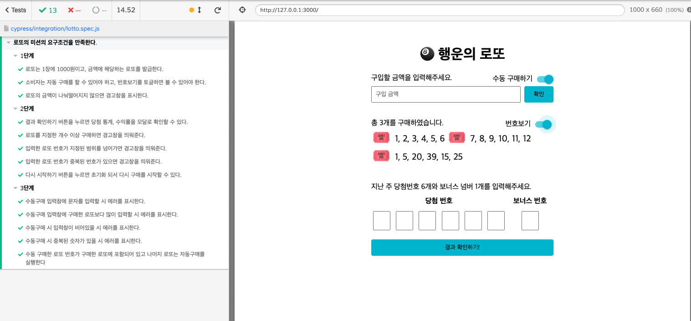

<p align="middle" >
  
</p>
<h2 align="middle">행운의 로또</h2>
<p align="middle">자바스크립트로 구현 하는 로또 어플리케이션</p>
<p align="middle">
  
  
  
  
  
</p>

<p align="middle">
  <a href="https://eungyucho.github.io/js-lotto/">🖥️ 데모 링크</a>
</p>

## 🔥 Projects!

<p align="middle">
  
</p>

### 🎯 step1

- [x] 로또는 1장에 1000원이고, 금액에 해당하는 로또를 발급한다.
- [x] 소비자는 자동 구매를 할 수 있어야 하고, 번호보기를 토글하면 볼 수 있어야 한다.
- [x] 로또의 금액이 나눠떨어지지 않으면 경고창을 표시한다.
- [x] 결과 확인하기 버튼을 누르면 당첨 통계, 수익률을 모달로 확인할 수 있다.

### 🎯🎯 step2

- [x] 로또를 지정한 개수 이상 구매하면 경고창을 띄워준다.
- [x] 입력한 로또 번호가 지정된 범위를 넘어가면 경고창을 띄워준다.
- [x] 입력한 로또 번호가 중복된 번호가 있으면 경고창을 띄워준다.
- [x] 다시 시작하기 버튼을 누르면 초기화 되서 다시 구매를 시작할 수 있다.

### 🎯🎯🎯 step3

- [x] 수동구매 입력창에 문자를 입력할 시 에러를 표시한다.
- [x] 수동구매 입력창에 구매한 로또보다 많이 입력할 시 에러를 표시한다.
- [x] 수동구매 시 입력창이 비어있을 시 에러를 표시한다.
- [x] 수동구매 시 중복된 숫자가 있을 시 에러를 표시한다.
- [x] 수동 구매한 로또 번호가 구매한 로또에 포함되어 있고 나머지 로또는 자동구매를 실행한다.

### 배포

- [x] 실행 가능한 페이지에 접근할 수 있도록 github page 기능을 이용하고, 해당 링크를 PR과 README에 작성한다.

<br>

## ⚙️ Before Started

####  로컬에서 서버 띄워서 손쉽게 static resources 변경 및 확인하는 방법

parcel로 번들링 되어 있습니다. 아래 커맨드를 통해 실행할 수 있습니다.

```
yarn
yarn start
```

<br/>

## 👏 Contributing

만약 미션 수행 중에 개선사항이 보인다면, 언제든 자유롭게 PR을 보내주세요.

<br/>

## 🐞 Bug Report

버그를 발견한다면, [Issues](https://github.com/next-step/js-lotto/issues)에 등록해주세요.

<br/>

## 📝 License

This project is [MIT](https://github.com/next-step/js-lotto/blob/main/LICENSE) licensed.
