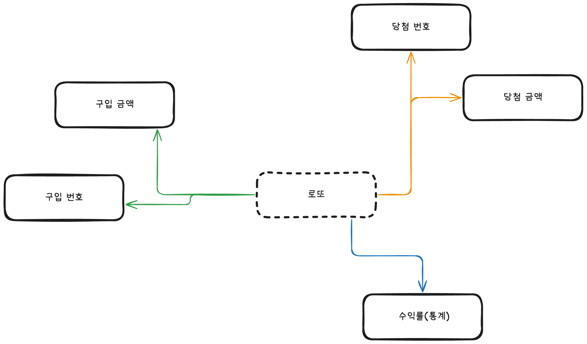

## 학습 목표

- UI와 도메인 영역을 분리할 수 있는 설계를 고민해보고, 목적에 맞게 객체와 함수를 활용
- 단위 테스트 기반으로 점진적인 리팩터링

## 요구 사항

로또 구입 금액을 입력하면 구입 금액에 해당하는 만큼 로또를 발행해야 한다.
로또 1장의 가격은 1,000원이다.
당첨 번호와 보너스 번호를 입력받는다.
사용자가 구매한 로또 번호와 당첨 번호를 비교하여 당첨 내역 및 수익률을 출력한다.

당첨은 1등부터 5등까지 있다. 당첨 기준과 금액은 아래와 같다.

- 1등: 6개 번호 일치 / 2,000,000,000원
- 2등: 5개 번호 + 보너스 번호 일치 / 30,000,000원
- 3등: 5개 번호 일치 / 1,500,000원
- 4등: 4개 번호 일치 / 50,000원
- 5등: 3개 번호 일치 / 5,000원

### 추가 요구사항

- 로또 번호는 오름차순으로 정렬하여 보여준다(이미 했음)
- 사용자가 잘못된 값을 입력한 경우 throw문을 사용해 예외를 발생시키고, 에러 메시지를 출력 후 그 부분부터 입력을 다시 받는다.(throw문 처리한 부분만 살짝 보완 필요)
- 당첨 통계를 출력한 뒤에는 재시작/종료 여부를 입력받는다.
  - 재시작할 경우 구입 금액 입력부터 게임을 다시 시작하고, 종료하는 경우 그대로 프로그램을 종료시킨다.

## 도메인 기준

"로또"라는 메인 영역이 존재하면

- 구입
- 당첨
- 통계

라는 공통 키워드를 추출할 수 있었고
이를 기준으로 도메인으로 나눠 진행한다.

## 작은 단위로 정의

### 공통

- 로또 번호를 추출한다.

### 구입

- 로또 구입 금액을 입력한다
- 구입 금액에 해당하는 만큼 로또를 발행한다.
- 로또 1장의 가격은 1,000원이다
- 사용자가 구매한 로또 번호를 확인할 수 있다.

### 당첨

- 당첨 번호를 입력 받는다
- 보너스 (당첨) 번호를 입력 받는다
- 사용자가 구매한 로또 번호와 당첨 번호를 비교한다.

 
당첨은 1등부터 5등까지 있다. 당첨 기준과 금액은 아래와 같다.

- 1등: 6개 번호 일치 / 2,000,000,000원
- 2등: 5개 번호 + 보너스 번호 일치 / 30,000,000원
- 3등: 5개 번호 일치 / 1,500,000원
- 4등: 4개 번호 일치 / 50,000원
- 5등: 3개 번호 일치 / 5,000원

### 통계

- 수익률을 출력한다.
